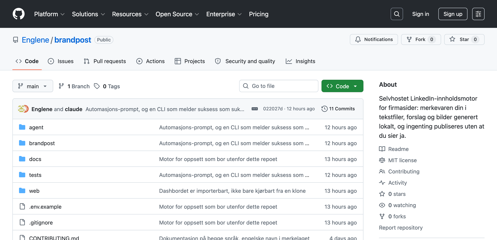
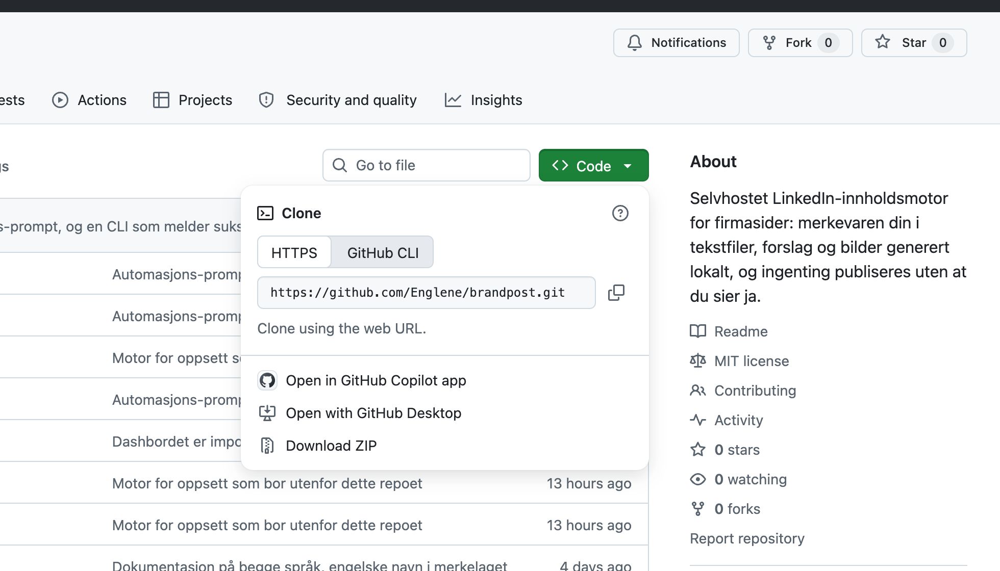

# Kom i gang, fra helt null

Denne guiden går ut fra at du aldri har brukt GitHub, ikke vet hva en API-nøkkel
er, og ikke skriver kode. Det går helt fint. Du skal ikke programmere noe. Du skal
laste ned en mappe, hente et par nøkler, og la en KI-assistent gjøre resten.

Sett av rundt en halvtime første gang.

**Hva du sitter igjen med:** ferdige LinkedIn-innlegg til firmasiden din, med
bilde og tekst, som dukker opp av seg selv på de dagene du har valgt. Du leser
gjennom, og trykker publiser på det du liker. Ingenting går ut uten at du sier ja.

---

## Del 0: Skaff deg en assistent først

Alt det tekniske gjøres av en KI-assistent som kan jobbe med filer på maskinen
din. Du trenger **én** av disse, og det er verdt å ta den først, for den hjelper
deg med alt det andre.

| | Hvor | Koster |
|---|---|---|
| **Claude Code** (enklest) | https://claude.ai/download | abonnement |
| **Codex** | følger med ChatGPT-abonnement | abonnement |

Last ned **appen**, ikke noe annet. Du skal ikke innom noe som heter terminal
eller kommandolinje. Åpne appen, logg inn, og du har et chattevindu som i tillegg
kan lese og skrive filer.

### La assistenten sjekke maskinen din

Programmet er skrevet i Python. Det er sannsynligvis ikke installert på maskinen
din fra før, og du skal ikke installere det selv. Skriv dette til assistenten:

```
Jeg skal sette opp et program som trenger Python 3.11 eller nyere. Sjekk om jeg
har det, og installer det for meg hvis jeg ikke har. Jeg er ikke teknisk, så
forklar hva du gjør underveis.
```

Den ordner det. Hvis den spør om passordet ditt til maskinen underveis, er det
normalt ved installasjon av programmer, og du skriver det inn i det vanlige
passordvinduet fra operativsystemet, aldri i chatten.

> **Er du på Windows?** Alt i denne guiden virker, men noen kommandoer ser litt
> annerledes ut. Si «jeg er på Windows» til assistenten med en gang, så tar den
> hensyn til det resten av veien.

---

## Del 1: Hva er GitHub, og hvordan får jeg tak i koden

### Hva GitHub er

GitHub er en nettside der folk legger ut programkode, omtrent som Google Drive er
for dokumenter. En «repo» (kort for repository) er bare en mappe med filer.

Koden du skal bruke ligger her, åpent for alle:

**https://github.com/Englene/brandpost**

Du trenger ikke bruker for å laste den ned. Slik ser den ut:



Det du ser er en filliste. `agent`, `brandpost`, `docs` og `web` er mapper.
Teksten til høyre for hver er en beskrivelse av siste endring. Du trenger ikke
forstå noe av det.

### Laste den ned

Trykk på den grønne **Code**-knappen, og velg **Download ZIP** nederst:



Du får en zip-fil i nedlastingsmappa. Dobbeltklikk for å pakke den ut. Du har nå
en mappe som heter `brandpost-main`. Flytt den dit du vil ha den, for eksempel i
Dokumenter. **Husk hvor du la den**, du skal peke assistenten dit om litt.

> **Enklere alternativ:** har du allerede Claude Code eller Codex, kan du hoppe
> over nedlastingen og be assistenten om det i stedet:
> «Last ned https://github.com/Englene/brandpost til Dokumenter og åpne mappa.»

---

## Del 2: Hva er en API-nøkkel

Programmet skal lage bilder til innleggene dine. Det gjør det ikke selv, det
spør en bildetjeneste om hjelp, på samme måte som du ville spurt ChatGPT.

For at tjenesten skal vite hvem som spør, og hvem regningen går til, trenger du en
**API-nøkkel**. Det er en lang tekststreng som begynner med `sk-` og fortsetter
med rundt hundre tilfeldige tegn:

```
sk-proj-DETTE-ER-BARE-ET-EKSEMPEL-EN-EKTE-NOKKEL-ER-MYE-LENGER-OG-TILFELDIG
```

Tre ting å vite om den:

- **Den er som et passord.** Alle som har den, kan bruke den og du får regningen.
  Aldri lim den inn i en chat, en e-post eller et dokument du deler.
- **Den vises bare én gang.** Når du lager den, får du se den én eneste gang. Kopier
  den med det samme. Mister du den, lager du bare en ny.
- **Den koster penger per bruk.** Ikke et abonnement, men noen ører per bilde. Du
  setter selv et tak.

---

## Del 3: Lag OpenAI-konto og hent nøkkelen

Bildene lages av OpenAI (samme selskap som ChatGPT). Merk at dette er en **egen
konto** fra ChatGPT-abonnementet ditt, med egen betaling. Har du ChatGPT Plus,
dekker det ikke dette.

Gjør disse tre i rekkefølge. Lenkene går rett dit, så du slipper å lete:

**1. Lag konto**
https://platform.openai.com/signup
Bruk e-post eller Google. Du må bekrefte et telefonnummer.

**2. Legg inn betaling og sett et tak**
https://platform.openai.com/settings/organization/billing/overview
Legg inn kort og fyll på et lite beløp, for eksempel 10 dollar. Det holder lenge.

Finn deretter **Limits** i menyen på samme side, og sett en månedlig grense. Da
kan det aldri løpe løpsk, uansett hva som skjer. Gjør dette før du lager nøkkelen,
så slipper du å tenke på det siden.

**3. Lag nøkkelen**
https://platform.openai.com/api-keys
Trykk **Create new secret key**, gi den et navn du kjenner igjen (for eksempel
«brandpost»), og trykk opprett. **Kopier nøkkelen med en gang** og lim den
midlertidig et sted bare du ser, for eksempel i en tom Notes-fil. Du skal bruke
den om et øyeblikk, og deretter kan du slette den derfra.

> Får du en side som ber deg «verifisere at du er et menneske», er det bare
> OpenAIs vanlige bot-sjekk. Kryss av og fortsett.

### Hva med teksten i innleggene?

Bildene kommer fra OpenAI. **Teksten** kommer fra en annen modell, og der har du
to valg:

| Har du dette | Da trenger du |
|---|---|
| Claude Code-abonnement (eller ChatGPT-abonnement med Codex) | ingenting mer, assistenten skriver teksten selv |
| Ingen av delene | en nøkkel til fra https://console.anthropic.com/settings/keys |

De fleste som leser denne guiden har det første. Assistenten du limer prompten
inn i, er den samme som skriver teksten.

---

## Del 4: Sett det opp

Nå gjør assistenten fra Del 0 resten. Åpne den i mappa du lastet ned: i Claude
Code åpner du mappa i appen, i Codex peker du den på mappa.

Så limer du inn dette, ordrett:

```
Les agent/setup.md i denne mappa og gjør det den sier. Jeg har ikke gjort dette
før, så forklar underveis og spør meg om én ting av gangen. Sjekk først at alt
som trengs er installert, og fiks det som mangler.
```

Assistenten intervjuer deg nå om firmaet ditt: hva dere gjør, hvem dere snakker
til, hva dere vil være kjent for, og hvordan dere høres ut. **Dette er den delen
som betyr noe.** Motoren kan tegne og formulere, men den kan ikke vite hva firmaet
ditt mener. Bruk et kvarter på svarene, så blir innleggene deretter.

Den ber deg også om OpenAI-nøkkelen. Da limer du inn den du kopierte. Den lagres i
en fil som heter `.env` i mappa, og den fila deles aldri videre.

Når intervjuet er ferdig, be om et prøveinnlegg:

```
Lag tre utkast til meg nå, så jeg får se hvordan det ser ut.
```

---

## Del 5: Se og godkjenne innleggene

Utkastene havner ikke i en app eller på en nettside du logger inn på. De ligger
som filer på din egen maskin, og du ser på dem i et **dashbord** som også kjører
på din egen maskin.

### Hva «localhost» betyr

Be assistenten om dette:

```
Start dashbordet, og gi meg adressen jeg skal åpne.
```

Den svarer med en adresse som ser slik ut:

```
http://localhost:5050
```

Den limer du inn i nettleseren, akkurat som en vanlig nettadresse.

`localhost` betyr **denne maskinen**. Det er ikke en side på internett. Ingen
andre kan åpne den, ikke engang om de har adressen, for den peker på maskinen som
skriver den inn. Tallet `5050` er bare en dør inn til det ene programmet, sånn at
flere programmer kan kjøre samtidig uten å krasje.

Der ser du en kalender med innleggene dine. Du kan lese, rette teksten, slette
det du ikke liker, og planlegge når noe skal ut. **Det er her du godkjenner.**
Ingenting går til LinkedIn uten at du gjør noe her.

### Det ene som overrasker folk

Dashbordet finnes bare så lenge programmet kjører. Lukker du terminalvinduet
assistenten startet det i, eller skrur av maskinen, blir adressen død og
nettleseren sier «kan ikke nås». Innholdet ditt er trygt, det ligger i filene,
men vinduet inn til det er borte.

Du har to valg:

- **Starte det når du trenger det.** Be assistenten «start dashbordet» hver gang.
  Helt greit hvis du ser på innlegg én gang i uka.
- **La det alltid kjøre.** Det setter Del 6 opp for deg, og da er adressen der
  bestandig, også etter en omstart.

> Vil du åpne dashbordet fra mobilen eller en annen maskin i huset, si det til
> assistenten. Da må det startes på en annen måte, og du bør vite at dashbordet
> ikke har passord: alle på samme nettverk kommer inn. På et hjemmenettverk er
> det som regel greit, på en kafé er det ikke det.

---

## Del 6: Få det til å gå av seg selv

Så langt må du be om innlegg hver gang. Neste steg er at de bare dukker opp.

Lim inn dette til samme assistent:

```
Les agent/automate.md og sett opp automatikken for meg. Jeg vil ha nye utkast
automatisk, og jeg vil godkjenne dem selv før noe publiseres.
```

Den spør hvilke dager du vil ha innlegg, og setter opp resten. Den viser deg også
at jobbene faktisk kjører, ikke bare at de burde.

### De to måtene å planlegge på

Assistenten setter opp jobbene på maskinen din. I tillegg kan du la selve
skrivingen skje som en fast oppgave i verktøyet du bruker:

- **Claude Code** har *routines*: faste kjøringer på et klokkeslett. Be
  assistenten: «Lag en routine som kjører agent/generate.md hver mandag klokka 7.»
- **Codex** har *automations*, som er det samme. Du lager en ny automation, velger
  prosjektet, og skriver instruksen den skal kjøre.

Begge deler forutsetter at maskinen er på. Sover laptopen klokka sju om morgenen,
skjer det ingenting. Si det til assistenten, så velger den et tidspunkt som passer
eller foreslår at det heller kjører på en maskin som alltid er på.

---

## Hva det koster

| | Pris |
|---|---|
| Selve programmet | gratis, åpen kildekode |
| Bilder (OpenAI) | noen ører per bilde, se https://openai.com/api/pricing |
| Tekst | inkludert i Claude Code- eller ChatGPT-abonnementet ditt |

Med fire innlegg i uka snakker vi småpenger i måneden på bilder. Taket du satte i
Del 3 gjør at det uansett ikke kan løpe løpsk.

---

## Trygghet, kort

- **Ingenting publiseres av seg selv.** Publisering er avslått fra start, og selv
  når du skrur den på, går bare de innleggene ut som du selv har planlagt.
- **Alt ligger på din egen maskin.** Utkast, bilder og merkevaren din. Ingen
  skytjeneste eier innholdet ditt.
- **Nøkkelen din deles aldri.** Den ligger i `.env`, som er satt opp til aldri å
  følge med hvis du deler mappa videre.

---

## Hvis noe går galt

Du trenger ikke feilsøke selv. Lim inn feilmeldingen til assistenten og skriv «hva
betyr dette, og kan du fikse det?». Det er nettopp det den er god til.

De vanligste tingene:

| Det skjer | Som regel fordi |
|---|---|
| «Siden kan ikke nås» på localhost | dashbordet kjører ikke. Be assistenten starte det, se Del 5 |
| «ukjent merke» | oppsettet ble ikke fullført, kjør `agent/setup.md` på nytt |
| Ingen bilder, bare tekst | OpenAI-nøkkelen mangler eller det er tomt på kontoen |
| Ingenting skjer på de dagene jeg valgte | maskinen var av eller sov, se Del 6 |
| Innleggene føles generiske | intervjuet gikk for fort. Be assistenten om å ta det på nytt, og vær konkret om hva dere ALDRI ville sagt |

---

## Kort oppsummert

1. Skaff Claude Code eller Codex, og be den installere Python (Del 0)
2. Last ned mappa fra https://github.com/Englene/brandpost
3. Lag OpenAI-konto, sett et forbrukstak, kopier nøkkelen
4. Åpne mappa i assistenten, lim inn: *«Les agent/setup.md og gjør det den sier»*
5. Be om dashbordet: *«Start dashbordet, og gi meg adressen jeg skal åpne»*, og
   åpne `http://localhost:5050` i nettleseren. Det er her du godkjenner.
6. Lim inn: *«Les agent/automate.md og sett opp automatikken»*
7. Les gjennom utkastene som dukker opp, og trykk publiser på dem du liker
